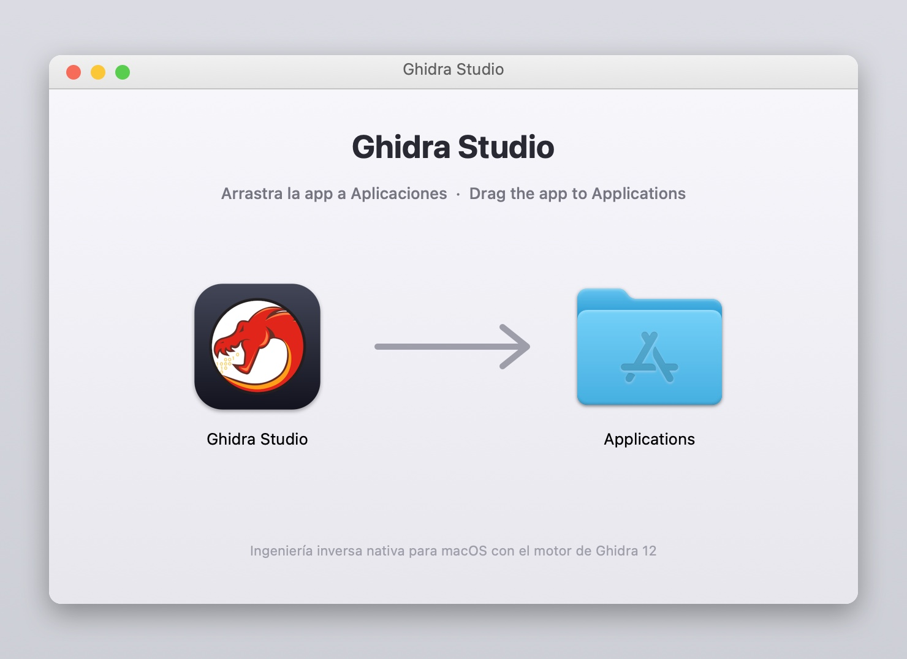
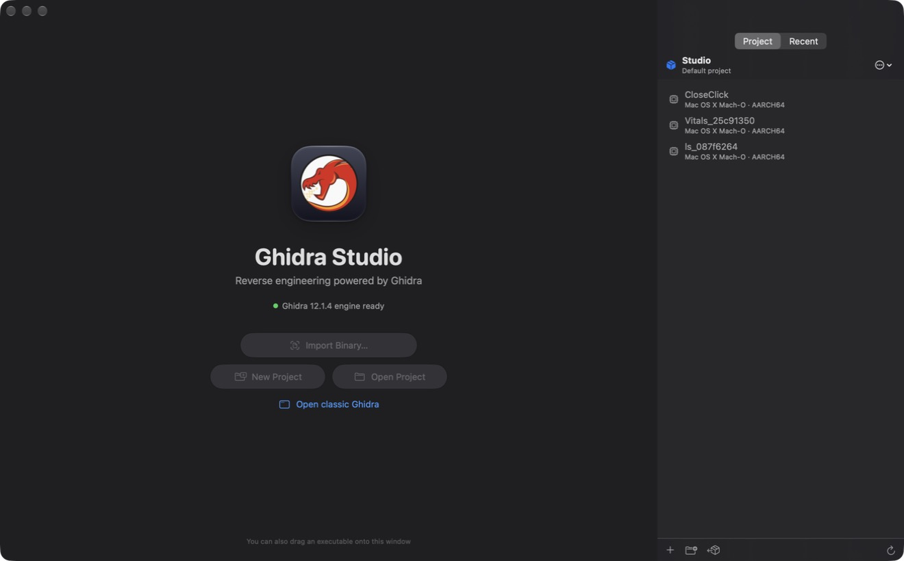
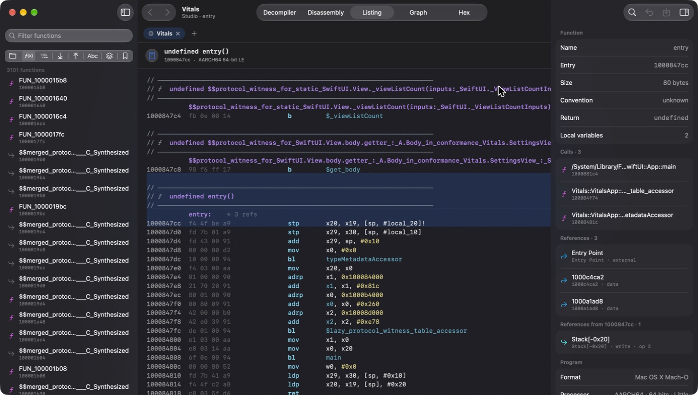
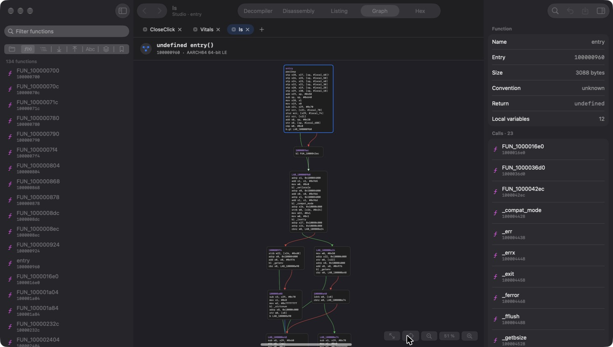
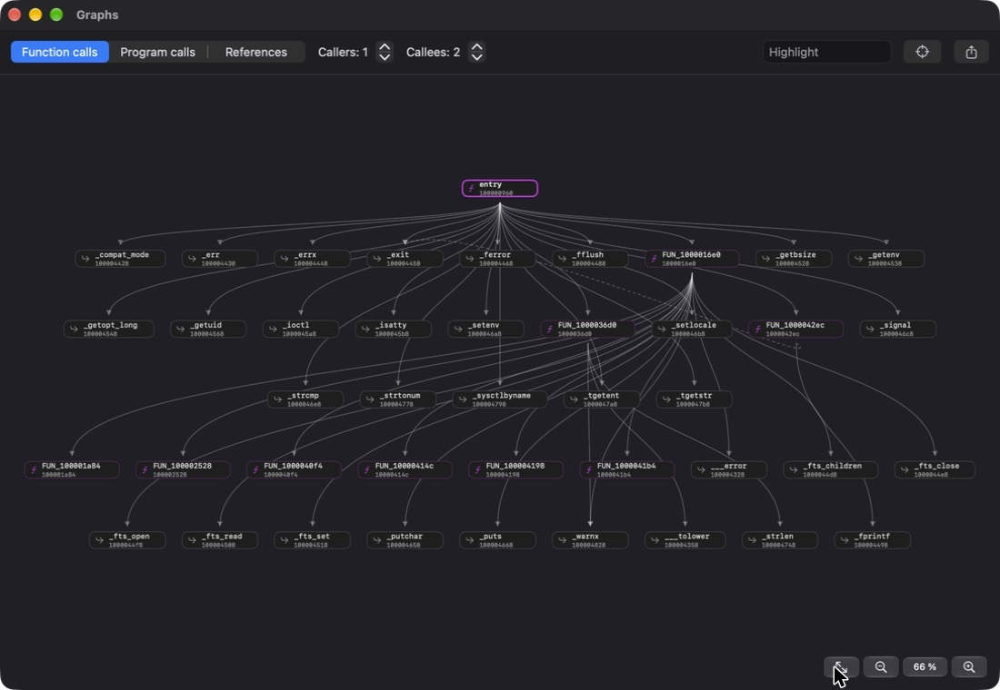
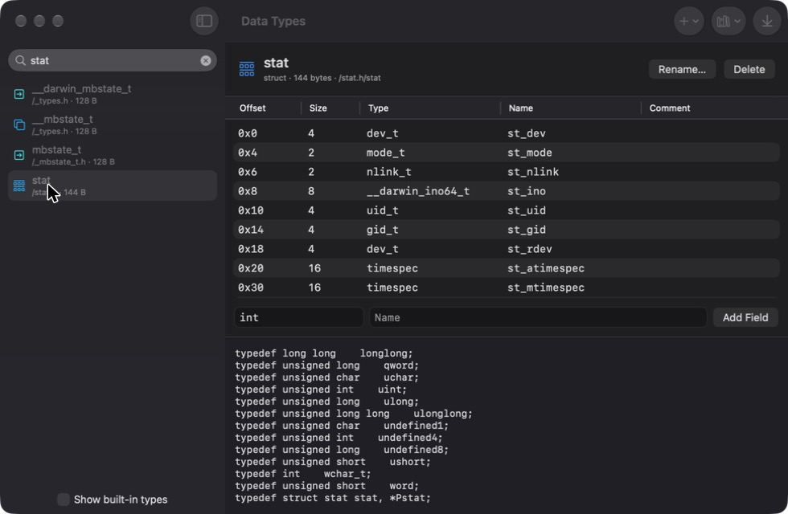
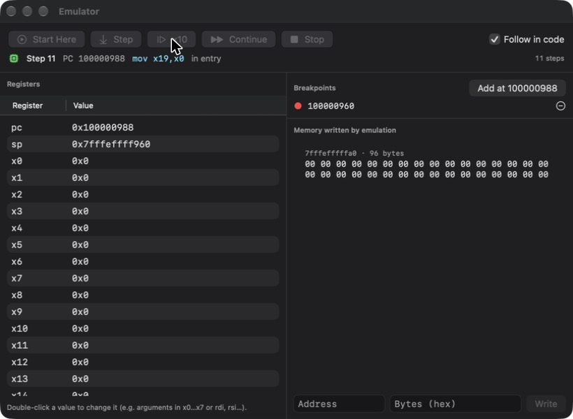
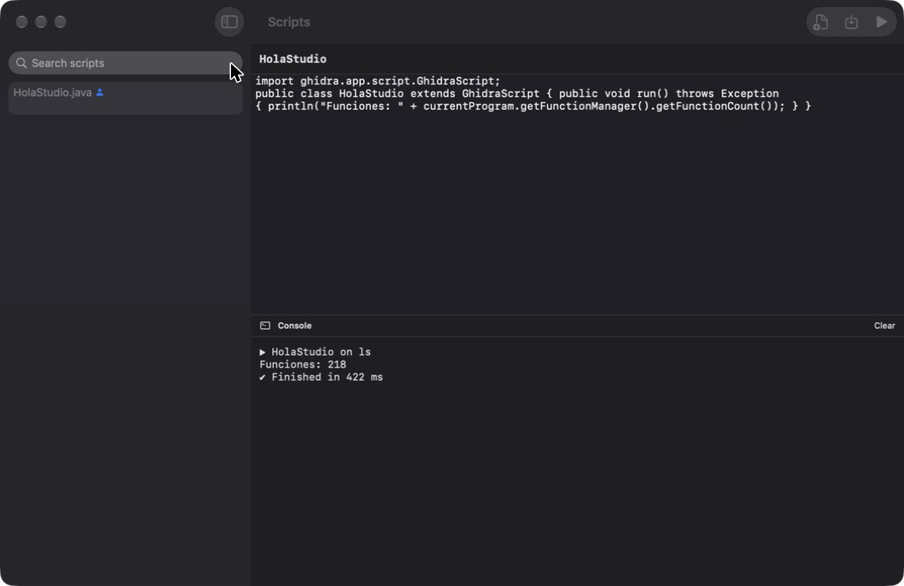
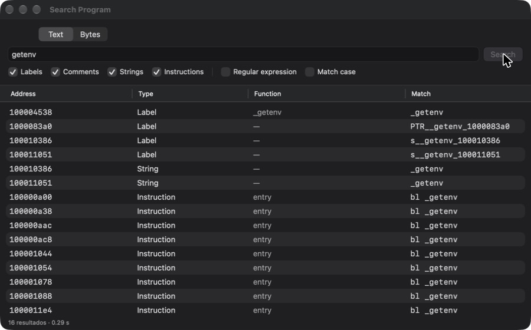

# Ghidra Studio

> Ghidra, con una interfaz que encaja mejor en un Mac.



**Ghidra Studio ofrece** una interfaz hecha con SwiftUI que utiliza el motor de Ghidra para analizar los programas. El análisis sigue a cargo de Ghidra; Studio presenta sus resultados en una interfaz nueva.

El repositorio incluye dos apps:

| App | Qué ofrece |
|---|---|
| `Ghidra.app` | Ghidra clásico empaquetado para Mac, con Java incluido y soporte para Apple Silicon. |
| `Ghidra Studio.app` | La nueva interfaz para Mac, creada con SwiftUI. |

---

## Capturas

### Inicio

Muestra los proyectos recientes y permite arrastrar un ejecutable a la ventana para abrirlo.



### Listado completo

Permite recorrer el programa y carga más líneas según te desplazas. A la derecha puedes consultar las llamadas y referencias relacionadas.



### Grafo de flujo

Muestra los distintos bloques de una función y cómo se conectan. Los colores indican qué caminos se siguen y cuáles no.



### Grafo de llamadas

Muestra qué funciones llaman a otra función y a cuáles llama esta. Puedes moverte por el grafo con doble clic. También puedes ver las llamadas del programa completo y las referencias a datos, y guardar los grafos como archivos `.dot`.



### Tipos de datos

Permite explorar y editar estructuras, uniones, enumeraciones y otros tipos. También puedes pegar código C para crear tipos a partir de él.



### Emulador

Incluye el emulador de Ghidra. Puedes avanzar paso a paso, usar puntos de ruptura y cambiar los registros. Como comprobación, ejecuté `fib(10)` y obtuve 55.



### Scripts

Puedes ejecutar los aproximadamente 300 scripts Java que incluye Ghidra, escribir los tuyos y ver los resultados en una consola.



### Búsqueda

Busca texto en etiquetas, cadenas, comentarios e instrucciones. También puedes usar expresiones regulares y buscar secuencias de bytes con comodines, como `48 8b ?? 05`.



> Las capturas están en inglés. Puedes cambiar el idioma desde *Ghidra Studio ▸ Idioma*.

---

## Cómo está construido

La app de Mac se encarga de la interfaz. En segundo plano, inicia Ghidra sin abrir su interfaz clásica y se comunica con él mediante mensajes JSON. Así, los análisis y la información que ves vienen del motor de Ghidra.

El descompilador entrega el código organizado en partes —por ejemplo, nombres de funciones, tipos y variables— junto con sus direcciones. Esto permite, por ejemplo, hacer clic en una llamada para ir a la función correspondiente.

### Archivos principales

```text
.
├── build.sh               # prepara Ghidra.app
├── build-studio.sh        # prepara Ghidra Studio.app
├── src/
│   ├── launcher.c         # inicia Ghidra.app
│   ├── launcher.sh        # inicia Ghidra clásico con Java incluido
│   ├── engine.sh          # inicia el motor de Studio
│   └── make_icon.swift    # crea el icono de la app
├── backend/src/studio/    # motor de Studio, escrito en Java
│   ├── StudioServer.java  # comunicación y proyectos
│   ├── Session.java       # estado y análisis de cada programa
│   ├── Types.java         # tipos de datos y lectura de código C
│   ├── Graphs.java        # gráficos de funciones y referencias
│   ├── Search.java        # búsqueda de texto y bytes
│   ├── Emulation.java     # emulador
│   ├── Compare.java       # comparación de programas
│   ├── Scripts.java       # ejecución de scripts de Ghidra
│   ├── Exports.java       # exportación de resultados
│   └── Msg.java           # mensajes del motor
├── app/                   # interfaz de Mac, escrita en SwiftUI
│   ├── Package.swift
│   ├── Sources/GhidraStudio/
│   └── Localization/      # traducciones
└── docs/capturas/
```

---

## Compilar

Necesitas:

- Un Mac con Apple Silicon y macOS 26 o posterior.
- Xcode 26 o posterior. Lo he probado con Xcode 27 y Swift 6.4.
- Conexión a internet la primera vez, para descargar Ghidra y Java. Se guardan en `.cache/`.

```bash
./build.sh            # prepara Ghidra.app
./build-studio.sh     # prepara Ghidra Studio.app
```

El primer paso descarga Ghidra 12.1.4 y Java 21 de Temurin, comprueba que las descargas sean correctas y prepara los componentes necesarios para Apple Silicon. Después crea `Ghidra.app`, genera su icono y la firma para uso local.

El segundo paso compila el motor Java y la interfaz Swift, los reúne en `Ghidra Studio.app` y prepara las traducciones.

Cada app ocupa aproximadamente 1,2 GB porque incluye su propia copia de Ghidra y Java.

### Traducciones

Los textos originales están en español y sus traducciones al inglés, en `app/Localization/en.json`. Cuando añadas texto a la interfaz, añade también su traducción y ejecuta:

```bash
python3 app/Localization/wrap_strings.py app/Sources/GhidraStudio/*.swift
```

Los mensajes del motor se traducen por separado en `Msg.java`.

---

## Funciones

- **Proyectos:** crear y abrir proyectos, incluidos los de Ghidra clásico (`.gpr`); organizar carpetas; importar programas; guardar con ⌘S; deshacer y rehacer; y trabajar con varias pestañas.
- **Vistas:** código decompilado, desensamblado, listado completo, gráficos y vista hexadecimal.
- **Edición:** cambiar nombres y tipos, añadir comentarios, crear funciones, desensamblar o borrar instrucciones y añadir marcadores. También puedes editar firmas de funciones, ensamblar instrucciones, cambiar bytes y referencias, y crear estructuras a partir de variables.
- **Herramientas:** tipos de datos, búsqueda, árbol y gráficos de llamadas, emulador, scripts y comparación de programas. Puedes exportar resultados a C, ASCII, XML y otros formatos, incluido el programa modificado.
- **Otras vistas:** árbol de símbolos, mapa de memoria editable y marcadores.
- **Idioma:** español e inglés.

## Funciones que todavía no incluye

Puedes abrir el proyecto en Ghidra clásico desde *Archivo ▸ Abrir proyecto en Ghidra clásico*.

Por ahora, Studio no incluye:

- **Depurador:** Ghidra se apoya en herramientas como LLDB o GDB y en un sistema de depuración amplio que Studio aún no integra.
- **BSim:** requiere configurar una base de datos.
- **Ghidra Server:** no permite trabajar con proyectos compartidos mediante el servidor de Ghidra.
- **Todas las opciones de Version Tracking:** Studio puede comparar funciones por coincidencia exacta, pero no incluye las herramientas completas de comparación por similitud.
- **Scripts de Python:** Ghidra 12 ya no incluye Jython, y PyGhidra requiere instalar Python y JPype por separado.

## Cosas que conviene saber

- La app tiene una firma local, pero no está notarizada por Apple. Si macOS la bloquea, prueba a hacer clic derecho en la app y elegir *Abrir*.
- Solo hay versión para Apple Silicon. Para ofrecer una versión para Mac Intel habría que preparar también sus componentes.
- El gráfico de flujo no muestra funciones con más de 2.500 bloques.
- Si otro Ghidra ya tiene abierto el proyecto predeterminado, Studio te avisa y se inicia sin ese proyecto.
- Al cerrar, Studio guarda los cambios automáticamente.
- Algunas capturas se hicieron con la app automatizada y muestran ventanas inactivas. Por eso pueden aparecer botones en gris.

## Créditos

- [Ghidra](https://github.com/NationalSecurityAgency/ghidra), de la NSA, con licencia Apache 2.0.
- [Eclipse Temurin](https://adoptium.net), por Java.
- El icono utiliza el dragón de Ghidra con un fondo añadido.

Proyecto personal, hecho para disfrutar más de Ghidra en Mac. Si encuentras un problema, abre un *issue*. Y si te animas a arreglarlo, también puedes enviar un *pull request*.
