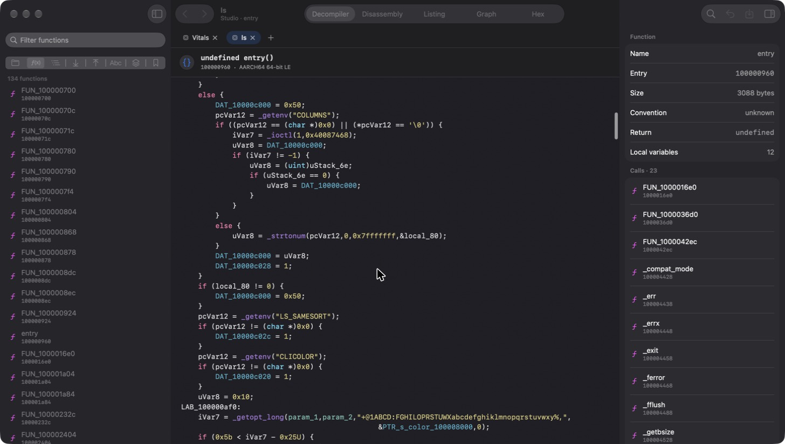

# Ghidra Studio

> Ghidra, con una interfaz que encaja mejor en un Mac.



**Ghidra Studio ofrece** una interfaz hecha con SwiftUI que utiliza el motor de Ghidra para analizar los programas. El análisis sigue a cargo de Ghidra; Studio presenta sus resultados en una interfaz nueva.

## Capturas

### Inicio

Muestra los proyectos recientes y permite arrastrar un ejecutable a la ventana para abrirlo.


### Listado completo

Permite recorrer el programa y carga más líneas según te desplazas. A la derecha puedes consultar las llamadas y referencias relacionadas.


### Grafo de flujo

Muestra los distintos bloques de una función y cómo se conectan. Los colores indican qué caminos se siguen y cuáles no.


### Grafo de llamadas

Muestra qué funciones llaman a otra función y a cuáles llama esta. Puedes moverte por el grafo con doble clic. También puedes ver las llamadas del programa completo y las referencias a datos, y guardar los grafos como archivos `.dot`.


### Tipos de datos

Permite explorar y editar estructuras, uniones, enumeraciones y otros tipos. También puedes pegar código C para crear tipos a partir de él.


### Emulador

Incluye el emulador de Ghidra. Puedes avanzar paso a paso, usar puntos de ruptura y cambiar los registros. Como comprobación, ejecuté `fib(10)` y obtuve 55.


### Scripts

Puedes ejecutar los aproximadamente 300 scripts Java que incluye Ghidra, escribir los tuyos y ver los resultados en una consola. También puedes escribir y ejecutar scripts de Python (PyGhidra) y usar un intérprete interactivo.


### Búsqueda

Busca texto en etiquetas, cadenas, comentarios e instrucciones. También puedes usar expresiones regulares y buscar secuencias de bytes con comodines, como `48 8b ?? 05`.


> Las capturas están en inglés. Puedes cambiar el idioma desde *Ghidra Studio ▸ Idioma*.

---

## Cómo está construido

La app de Mac se encarga de la interfaz. En segundo plano, inicia Ghidra sin abrir su interfaz clásica y se comunica con él mediante mensajes JSON. Así, los análisis y la información que ves vienen del motor de Ghidra.

El descompilador entrega el código organizado en partes —por ejemplo, nombres de funciones, tipos y variables— junto con sus direcciones. Esto permite, por ejemplo, hacer clic en una llamada para ir a la función correspondiente.

### Archivos principales

```text
.
├── build.sh               # prepara Ghidra.app
├── build-studio.sh        # prepara Ghidra Studio.app
├── src/
│   ├── launcher.c         # inicia Ghidra.app
│   ├── launcher.sh        # inicia Ghidra clásico con Java incluido
│   ├── engine.sh          # inicia el motor de Studio
│   ├── engine.py          # aloja el motor dentro de Python (PyGhidra)
│   └── make_icon.swift    # crea el icono de la app
├── backend/patch_ghidra.py # corrige una clase de Ghidra al compilar
├── backend/src/studio/    # motor de Studio, escrito en Java
│   ├── StudioServer.java  # comunicación y proyectos
│   ├── Session.java       # estado y análisis de cada programa
│   ├── Types.java         # tipos de datos y lectura de código C
│   ├── Graphs.java        # gráficos de funciones y referencias
│   ├── Search.java        # búsqueda de texto y bytes
│   ├── Emulation.java     # emulador
│   ├── Compare.java       # comparación de programas
│   ├── Scripts.java       # ejecución de scripts de Ghidra
│   ├── Python.java        # intérprete de Python
│   ├── VersionTracking.java # sesiones, correladores y marcado
│   ├── Bsim.java          # búsqueda de funciones similares
│   ├── Repo.java          # Ghidra Server y control de versiones
│   ├── Extensions.java    # extensiones de Ghidra
│   ├── Fid.java           # bases de datos Function ID
│   ├── More.java          # memoria, símbolos, pila, sumas y otras utilidades
│   ├── Views.java         # vista general, selecciones por flujo y grafos de p-code
│   ├── Debug.java         # breakpoints guardados en el programa, como los de Ghidra
│   ├── ClassicDebugger.java # abre el Depurador del Ghidra clásico con un programa
│   ├── Exports.java       # exportación de resultados
│   ├── Annotate.java      # etiquetas, referencias, equates y edición del listado
│   ├── TypeTools.java     # gestor de tipos, archivos y sincronización
│   ├── TypeEdit.java      # editor de estructuras con deshacer propio
│   ├── Decomp.java        # acciones del descompilador y taint integrado
│   ├── Ctadl.java         # taint con CTADL
│   ├── Finder.java        # exploración de memoria y tablas
│   ├── CompareTools.java  # comparación de funciones, Diff, BSim y Function ID
│   ├── ImportExtras.java  # importación por lotes y acciones por formato
│   ├── ProjectTools.java  # otros proyectos, copias y sistemas de archivos
│   ├── Workbench.java     # análisis, scripts, SARIF y URLs de Ghidra
│   └── Msg.java           # mensajes del motor
├── app/                   # interfaz de Mac, escrita en SwiftUI
│   ├── Package.swift
│   ├── Sources/GhidraStudio/
│   └── Localization/      # traducciones
└── docs/capturas/
```

---

## Compilar

Necesitas:

- Un Mac con Apple Silicon y macOS 26 o posterior.
- Xcode 26 o posterior. Lo he probado con Xcode 27 y Swift 6.4.
- Conexión a internet la primera vez, para descargar Ghidra, Java y Python. Se guardan en `.cache/`.

```bash
./build.sh            # prepara Ghidra.app
./build-studio.sh     # prepara Ghidra Studio.app
```

El primer paso descarga Ghidra 12.1.4 y Java 21 de Temurin, comprueba que las descargas sean correctas y prepara los componentes necesarios para Apple Silicon. Después crea `Ghidra.app`, genera su icono y la firma para uso local.

El segundo paso compila el motor Java y la interfaz Swift, los reúne en `Ghidra Studio.app` y prepara las traducciones. También descarga Python 3.13 e instala en él PyGhidra, que viene dentro de Ghidra.

Cada app ocupa aproximadamente 1,3 GB porque incluye su propia copia de Ghidra y Java.

### Traducciones

Los textos originales están en español y sus traducciones al inglés, en `app/Localization/en.json`. Cuando añadas texto a la interfaz, añade también su traducción y ejecuta:

```bash
python3 app/Localization/wrap_strings.py app/Sources/GhidraStudio/*.swift
```

Los mensajes del motor se traducen por separado en `Msg.java`.

---

## Instalar
Más facil todavía: descarga el instalador .dmg en el apartado de Releases y arrastra el icono de la aplicación a la carpeta Aplicaciones.

Para generar el instalador tú mismo, ejecuta `./make-dmg.sh` después de compilar: crea `dist/GhidraStudio-1.1.dmg`.

## Funciones

- **Proyectos:** crear y abrir proyectos, incluidos los de Ghidra clásico (`.gpr`); organizar carpetas; guardar con ⌘S; deshacer y rehacer; trabajar con varias pestañas; archivar el proyecto en un `.zip` y restaurarlo; ver otro proyecto en modo lectura y copiar de él; copiar, enlazar y marcar archivos como de solo lectura; y abrir programas por su URL `ghidra://`, también los de un servidor.
- **Importación:** elegir el cargador y el procesador, ajustar las opciones del cargador (dirección base, librerías dependientes), explorar contenedores como ZIP, firmwares o imágenes de disco para importar lo que hay dentro, ver o extraer sus archivos, y añadir un archivo a un programa ya abierto. El importador por lotes recorre carpetas y contenedores, agrupa lo que encuentra por cargador y deja elegir la profundidad y cómo se forman las rutas. Para formatos concretos: plantillas de claves, kernels de iOS, descompilar un JAR y exportar un APK como proyecto de Eclipse.
- **Vistas:** código decompilado, desensamblado, listado completo, gráficos (con bloques agrupables) y vista hexadecimal. Puedes abrir ventanas adicionales de listado o descompilado, cada una con su propia posición e historial, o ver el listado y el descompilado lado a lado en la misma ventana.
- **Edición:** cambiar nombres y tipos, añadir comentarios, crear funciones, desensamblar o borrar instrucciones y añadir marcadores. También puedes editar firmas de funciones, ensamblar instrucciones, cambiar bytes y referencias, y crear estructuras a partir de variables.
- **Descompilador:** dividir una variable reutilizada en una nueva, renombrar campos de estructuras, cambiar el tipo de variables globales, forzar la firma en una llamada concreta, elegir el campo de una unión, fijar los parámetros y las variables locales, resaltar de dónde viene o a dónde va un valor (slicing) y ajustar las opciones del descompilador. También convertir constantes y darles nombre (equates), cambiar el tipo de un campo o del valor devuelto, buscar texto en el código descompilado de todo el programa, gestionar extensiones de especificación y seguir un dato con taint (motor integrado o CTADL).
- **Listado:** operar sobre un rango seleccionado (desensamblar, borrar, crear una estructura o una cadena), crear arrays, cambiar el formato de un dato y fijar valores de registros, por ejemplo para el modo Thumb. También desensamblar en un modo concreto o sin seguir el flujo, y escribir texto o números en la vista hexadecimal. Se pueden plegar funciones, abrir estructuras y arrays, editar un campo de estructura sin salir del listado, aplicar los tipos usados recientemente, resaltar y colorear rangos, y saltar a la siguiente instrucción, dato, etiqueta, función o marcador.
- **Funciones:** editor con convención de llamada, atributos, variables de la pila y etiquetas.
- **Tipos de datos:** editor de estructuras con inserción en un offset, reordenación, campos de bits, empaquetado y alineación, que trabaja sobre una copia con deshacer propio hasta que aplicas los cambios; edición de enums; definiciones de función; e importación y exportación de archivos `.gdt`. El gestor de tipos añade categorías, archivos de tipos del proyecto, sincronización con el archivo de origen, búsqueda de usos de un tipo, favoritos y lectura de cabeceras de C con perfiles.
- **Análisis:** opciones propias de cada analizador, ejecución de un analizador suelto, configuraciones de análisis guardadas, validadores, ubicaciones de archivos DWARF y carga de símbolos PDB, también desde servidores de símbolos.
- **Herramientas:** búsqueda (texto, bytes, valores numéricos, cadenas en varias codificaciones, expresiones regulares, tablas de direcciones, patrones de instrucciones, referencias directas, exploración de memoria con filtros, ensamblador con comodines y reemplazo), tablas de símbolos, cadenas, constantes y relocaciones, árbol y gráficos de llamadas, emulador, scripts con argumentos, comparación de programas (pudiendo aplicar las diferencias) y comparación de funciones lado a lado, por código descompilado con tokens emparejados, desensamblado, bytes o grafo. Puedes exportar resultados a C, ASCII, XML y otros formatos, incluido el programa modificado.
- **Version Tracking:** sesiones entre dos versiones de un programa, todos los correladores de Ghidra con sus opciones, Auto Version Tracking, aceptar o rechazar coincidencias, aplicar el marcado (nombres, firmas, comentarios, etiquetas y tipos) y comparar el código lado a lado.
- **BSim:** bases de datos locales de firmas, añadir programas y buscar funciones similares para copiar sus nombres. También acepta servidores PostgreSQL y Elasticsearch.
- **Ghidra Server y control de versiones:** conectar a un servidor, gestionar repositorios y usuarios, crear proyectos compartidos, y añadir archivos al control de versiones con check-out, check-in, historial y copias de versiones anteriores.
- **Python:** scripts de PyGhidra e intérprete interactivo con autocompletado, con Python incluido en la app.
- **Scripts:** además de ejecutarlos, renombrarlos, borrarlos, darles un atajo, buscar en su código y editarlos en VS Code, Xcode o Eclipse.
- **Extensiones:** instalar y desinstalar extensiones de Ghidra. Se comparten con Ghidra clásico.
- **Function ID:** crear bases de datos propias (`.fidb`), adjuntar las que ya tengas, añadir bibliotecas desde programas del proyecto y aplicarlas al analizar.
- **Herramientas del programa:** espacios de nombres y clases, bibliotecas externas, editor del marco de pila, sumas de comprobación, entropía y archivos de código fuente. También etiquetas e historial, editor de referencias, equates, comentarios, valores de registros, cadenas con traducción, imágenes y sonidos embebidos, resultados SARIF y opciones del programa.
- **Visor de bytes:** hexadecimal, enteros, octal, binario, ASCII, direcciones y desensamblado, varios a la vez, con edición en el sitio.
- **Depurador:** ejecutar un programa, adjuntarse a un proceso o conectar con un servidor remoto (gdbserver, debugserver, QEMU). Breakpoints en el margen del código (los mismos que usa Ghidra clásico), puntos de observación, paso a paso, pila con los nombres de tu análisis, registros y memoria editables, expresiones y consola de LLDB. El listado y el descompilador siguen la instrucción en curso. Cada parada queda grabada en una traza: puedes volver a cualquier instante anterior, grabar una serie de pasos, guardar la traza y abrirla después sin el proceso. Desde cualquier instante puedes arrancar el emulador con ese mismo estado. La consola también envía texto a la entrada del programa, y para apps protegidas Studio prepara una copia firmada para depuración. Usa LLDB, así que necesita Xcode o las Command Line Tools; también acepta GDB y cualquier adaptador DAP. Los breakpoints admiten condiciones y comandos, y se pueden comparar dos instantes de la traza.
- **Emulador:** además del paso por instrucción, paso a nivel de p-code, expresiones vigiladas e hilos.
- **Selección:** seleccionar una función, una subrutina, el flujo desde o hasta un punto, referencias, instrucciones, datos, bytes sin definir o cambios sin guardar, y desensamblar, borrar o marcar lo seleccionado de una vez.
- **Vista general:** una barra junto al código representa todo el programa, con el cursor, los marcadores, los cambios y la selección. Haz clic en ella para ir a esa parte.
- **Gráficos:** distribución por niveles, de izquierda a derecha, anidada, en círculo, radial, en rejilla o por fuerzas; vista satélite; caminos entre bloques y colores en el grafo de función, donde cada línea de un bloque se puede seleccionar y editar; grafos de flujo de bloques, de código y de datos; ocultar, enfocar y colapsar nodos; grafo de flujo de datos y de p-code del descompilador; y exportación a PNG, PDF, DOT, GraphML, JSON y CSV.
- **Personalización:** elegir qué columnas muestra el listado y en qué orden, o definir filas de campos a medida; flechas de flujo de los saltos y marcadores en el margen; temas de color y fuente; y atajos de teclado configurables, que se pueden exportar e importar.
- **Paneles acoplados:** cualquier ventana de herramientas se puede acoplar a la izquierda, a la derecha o abajo de la ventana principal, con pestañas (*Vista ▸ Paneles acoplados*).
- **Copias de recuperación:** Studio guarda aparte los cambios sin guardar y ofrece recuperarlos si la app se cerró de golpe.
- **Otras vistas:** árbol de símbolos, árbol del programa, mapa de memoria editable (también dividir, unir, mover y expandir bloques, bloques superpuestos o mapeados, y cambiar la dirección base) y marcadores.
- **Además:** imprimir la vista actual, abrir la documentación incluida con Ghidra desde el menú Ayuda y ver la ayuda de la ventana activa con F1.
- **Idioma:** español e inglés.

## Funciones que todavía no incluye

Puedes abrir el proyecto en Ghidra clásico desde *Archivo ▸ Abrir proyecto en Ghidra clásico*.

Studio no incluye:

- **Fusión de cambios en proyectos compartidos:** si otra persona sube una versión y tú también has modificado el archivo, Ghidra solo permite fusionar los cambios desde su interfaz clásica.
- **Extensiones con ventanas propias:** Studio carga sus analizadores, cargadores, procesadores y scripts, pero sus ventanas solo aparecen en Ghidra clásico.
- **Herramientas configurables y espacios de trabajo:** Studio no usa el sistema de herramientas de plugins del clásico.
- **Conectores de depuración de Windows y Linux** (WinDbg, x64dbg, drgn). Están LLDB, GDB si lo tienes instalado y cualquier adaptador DAP.

Algunas funciones dependen de programas que Ghidra no trae y que hay que instalar aparte: CTADL para el taint con motor externo, un descompilador de Java (JAD o CFR) para descompilar JAR y APK, y Eclipse con GhidraDev para editar scripts allí.

Los paneles se acoplan a la ventana principal (*Vista ▸ Paneles acoplados*, o arrastrando su pestaña); no se acoplan unos dentro de otros como en el clásico.

## Cosas que conviene saber

- La app tiene una firma local, pero no está notarizada por Apple. Si macOS la bloquea, prueba a hacer clic derecho en la app y elegir *Abrir*.
- Solo hay versión para Apple Silicon. Para ofrecer una versión para Mac Intel habría que preparar también sus componentes.
- El gráfico de flujo no muestra funciones con más de 2.500 bloques.
- Si otro Ghidra ya tiene abierto el proyecto predeterminado, Studio te avisa y se inicia sin ese proyecto.
- Si hay cambios sin guardar al cerrar un programa o al salir, Studio pregunta si quieres guardarlos.
- Algunas capturas se hicieron con la app automatizada y muestran ventanas inactivas. Por eso pueden aparecer botones en gris.

## Créditos

- [Ghidra](https://github.com/NationalSecurityAgency/ghidra), de la NSA, con licencia Apache 2.0.
- [Eclipse Temurin](https://adoptium.net), por Java.
- [python-build-standalone](https://github.com/astral-sh/python-build-standalone), por Python.
- El icono utiliza el dragón de Ghidra con un fondo añadido.

Proyecto personal, hecho para disfrutar más de Ghidra en Mac. Si encuentras un problema, abre un *issue*. Y si te animas a arreglarlo, también puedes enviar un *pull request*.
